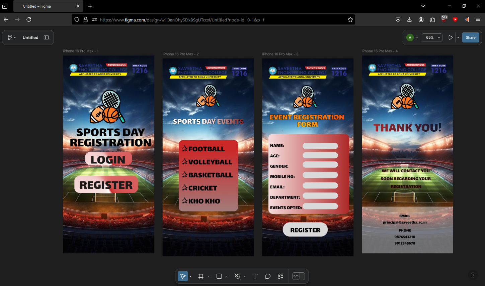

# Ex09 Event Registration Web Application
## Date: 14/05/2025

## AIM:
To design, develop and deploy a web application for event registration.

## DESIGN STEPS:

### Step 1:
Create a new frame.

### Step 2:
Select any one preset size of your choice.

### Step 3:
Select the shapes you need.

### Step 4:
Import images as needed.

### Step 5:
Create pages based on your need and link them.

### Step 6:

Validate the HTML and CSS code.

### Step 6:

Publish the website in the given URL.

## DESIGN TOOL:
Figma

## CODE:
```
html 1st:

<div class="container--0-">
  
  <svg
    width="307"
    height="83"
    viewBox="0 0 307 83"
    fill="none"
    xmlns="http://www.w3.org/2000/svg"
  >
    <rect
      width="307"
      height="83"
      rx="25"
      fill="url(#paint0_angular_8_5)"
    ></rect>
    <defs>
      <radialGradient
        id="paint0_angular_8_5"
        cx="0"
        cy="0"
        r="1"
        gradientUnits="userSpaceOnUse"
        gradientTransform="translate(153.5 41.5) rotate(53.8232) scale(42.3678 12.4374)"
      >
        <stop offset="0.11" stop-color="white"></stop>
        <stop offset="1" stop-color="#CB2828"></stop>
      </radialGradient>
    </defs>
  </svg>
  <svg
    width="226"
    height="65"
    viewBox="0 0 226 65"
    fill="none"
    xmlns="http://www.w3.org/2000/svg"
  >
    <rect
      width="226"
      height="65"
      rx="25"
      fill="url(#paint0_angular_28_11)"
    ></rect>
    <defs>
      <radialGradient
        id="paint0_angular_28_11"
        cx="0"
        cy="0"
        r="1"
        gradientUnits="userSpaceOnUse"
        gradientTransform="translate(113 32.5) rotate(55.4953) scale(32.5 9.34734)"
      >
        <stop offset="0.11" stop-color="white"></stop>
        <stop offset="1" stop-color="#CB2828"></stop>
      </radialGradient>
    </defs>
  </svg>
  <div class="text-0-1-4">LOGIN</div>
  <div class="text-0-1-5">REGISTER</div>
  
  <div class="text-0-1-7">SPORTS DAY REGISTRATION<br /></div>
</div>

css 1st


.container--0- {
  position: absolute;
  left: -1141px;
  top: -801px;
  width: 440px;
  height: 956px;
  background-color: #ffffff;
  justify-content: start;
  align-items: start;
}
.text-0-1-4 {
  width: 182px;
  height: 76px;
  color: #1c1919;
  font-size: 64px;
  font-family: Lalezar, "Regular";
  font-weight: 400;
  text-align: left;
  vertical-align: top;
}
.text-0-1-5 {
  width: 283px;
  height: 167px;
  color: #1c1919;
  font-size: 64px;
  font-family: Lalezar, "Regular";
  font-weight: 400;
  text-align: left;
  vertical-align: top;
}
.text-0-1-7 {
  width: 455px;
  height: 195px;
  color: #000000;
  font-size: 64px;
  font-family: Lalezar, "Regular";
  font-weight: 400;
  text-align: center;
  vertical-align: top;
}


html 2nd:

<div class="container--0-">
  
  <div class="text-0-1-3">SPORTS DAY EVENTS</div>
  <svg
    width="286"
    height="344"
    viewBox="0 0 286 344"
    fill="none"
    xmlns="http://www.w3.org/2000/svg"
  >
    <rect
      width="286"
      height="344"
      rx="20"
      fill="url(#paint0_linear_17_57)"
    ></rect>
    <defs>
      <linearGradient
        id="paint0_linear_17_57"
        x1="143"
        y1="0"
        x2="143"
        y2="344"
        gradientUnits="userSpaceOnUse"
      >
        <stop offset="0.13" stop-color="#CB2828"></stop>
        <stop offset="1" stop-color="#A27B7B"></stop>
      </linearGradient>
    </defs>
  </svg>
  <div class="text-0-1-5">
    ✰FOOTBALL<br />✰VOLLEYBALL<br />✰BASKETBALL<br />✰CRICKET<br />✰KHO KHO
  </div>
</div>

css 2nd:

.container--0- {
  position: absolute;
  left: -661px;
  top: -787px;
  width: 440px;
  height: 956px;
  background-color: #ffffff;
  justify-content: start;
  align-items: start;
}
.text-0-1-5 {
  width: 251px;
  height: 315px;
  color: #000000;
  font-size: 40px;
  font-family: Lalezar, "Regular";
  font-weight: 400;
  text-align: left;
  vertical-align: top;
}


html 3rd:

<div class="container--0-">
  
  <div class="text-0-1-3">EVENT REGISTRATION <br />FORM</div>
  
  <svg width="389" height="386" viewBox="0 0 389 386" fill="none" xmlns="http://www.w3.org/2000/svg">
    <rect width="389" height="386" rx="20" fill="url(#paint0_linear_21_66)"></rect>
    <defs>
      <linearGradient id="paint0_linear_21_66" x1="389" y1="193" x2="0" y2="193" gradientUnits="userSpaceOnUse">
        <stop stop-color="#AD2828"></stop>
        <stop offset="1" stop-color="#F6DCDC"></stop>
      </linearGradient>
    </defs>
  </svg>

  <div class="text-0-1-5">
    NAME:<br />
    AGE:<br />
    GENDER:<br />
    MOBILE NO:<br />
    EMAIL:<br />
    DEPARTMENT:<br />
    EVENTS OPTED:
  </div>

  <!-- Repeated input fields -->
  <div class="input-fields">
    <svg width="170" height="30" viewBox="0 0 170 30" fill="none" xmlns="http://www.w3.org/2000/svg">
      <rect width="170" height="30" rx="15" fill="#D9D9D9"></rect>
    </svg>
    <svg width="170" height="30" viewBox="0 0 170 30" fill="none" xmlns="http://www.w3.org/2000/svg">
      <rect width="170" height="30" rx="15" fill="#D9D9D9"></rect>
    </svg>
    <svg width="170" height="30" viewBox="0 0 170 30" fill="none" xmlns="http://www.w3.org/2000/svg">
      <rect width="170" height="30" rx="15" fill="#D9D9D9"></rect>
    </svg>
    <svg width="170" height="30" viewBox="0 0 170 30" fill="none" xmlns="http://www.w3.org/2000/svg">
      <rect width="170" height="30" rx="15" fill="#D9D9D9"></rect>
    </svg>
    <svg width="170" height="30" viewBox="0 0 170 30" fill="none" xmlns="http://www.w3.org/2000/svg">
      <rect width="170" height="30" rx="15" fill="#D9D9D9"></rect>
    </svg>
    <svg width="170" height="30" viewBox="0 0 170 30" fill="none" xmlns="http://www.w3.org/2000/svg">
      <path d="M0 15C0 6.71573 6.71573 0 15 0H155C163.284 0 170 6.71573 170 15C170 23.2843 163.284 30 155 30H15C6.71573 30 0 23.2843 0 15Z" fill="#D9D9D9"></path>
    </svg>
    <svg width="170" height="30" viewBox="0 0 170 30" fill="none" xmlns="http://www.w3.org/2000/svg">
      <path d="M0 15C0 6.71573 6.71573 0 15 0H155C163.284 0 170 6.71573 170 15C170 23.2843 163.284 30 155 30H15C6.71573 30 0 23.2843 0 15Z" fill="#D9D9D9"></path>
    </svg>
  </div>

  <svg width="217" height="69" viewBox="0 0 217 69" fill="none" xmlns="http://www.w3.org/2000/svg">
    <rect width="217" height="69" rx="34" fill="#D9D9D9"></rect>
  </svg>
  
  <div class="text-0-1-15">REGISTER</div>
</div>

css 3rd:

.container--0- {
  position: absolute;
  left: -181px;
  top: -787px;
  width: 440px;
  height: 956px;
  background-color: #ffffff;
  justify-content: start;
  align-items: start;
}
.text-0-1-3 {
  width: 361px;
  height: 91px;
  color: #ff9500;
  border-width: 1px;
  border-style: solid;
  border-color: #000000;
  font-size: 40px;
  font-family: Lalezar, "Regular";
  font-weight: 400;
  text-align: center;
  vertical-align: top;
}
.text-0-1-5 {
  width: 374px;
  height: 348px;
  color: #000000;
  font-size: 24px;
  font-family: Lalezar, "Regular";
  font-weight: 400;
  text-align: left;
  vertical-align: top;
}
.text-0-1-15 {
  width: 145px;
  height: 56px;
  color: #000000;
  font-size: 36px;
  font-family: Lalezar, "Regular";
  font-weight: 400;
  text-align: center;
  vertical-align: top;
}


html 4th:

<div class="container--0-">
  
  
  <div class="text-0-1-3">THANK YOU!</div>
  
  <div class="text-0-1-4">
    WE WILL CONTACT YOU <br />SOON REGARDING YOUR <br />REGISTRATION
  </div>
  
  <svg width="440" height="227" viewBox="0 0 440 227" fill="none" xmlns="http://www.w3.org/2000/svg">
    <g opacity="0.5" filter="url(#filter0_d_26_4)">
      <rect x="-40" width="586" height="305" fill="#D9D9D9"></rect>
      <rect x="-39.5" y="0.5" width="585" height="304" stroke="black"></rect>
    </g>
    
    <defs>
      <filter id="filter0_d_26_4" x="-44" y="0" width="594" height="313" filterUnits="userSpaceOnUse" color-interpolation-filters="sRGB">
        <feFlood flood-opacity="0" result="BackgroundImageFix"></feFlood>
        <feColorMatrix in="SourceAlpha" type="matrix" values="0 0 0 0 0 0 0 0 0 0 0 0 0 0 0 0 0 0 127 0" result="hardAlpha"></feColorMatrix>
        <feOffset dy="4"></feOffset>
        <feGaussianBlur stdDeviation="2"></feGaussianBlur>
        <feComposite in2="hardAlpha" operator="out"></feComposite>
        <feColorMatrix type="matrix" values="0 0 0 0 0 0 0 0 0 0 0 0 0 0 0 0 0 0 0.25 0"></feColorMatrix>
        <feBlend mode="normal" in2="BackgroundImageFix" result="effect1_dropShadow_26_4"></feBlend>
        <feBlend mode="normal" in="SourceGraphic" in2="effect1_dropShadow_26_4" result="shape"></feBlend>
      </filter>
    </defs>
  </svg>
  
  <div class="text-0-1-6">EMAIL<br />principal@saveetha.ac.in</div>
  
  <div class="text-0-1-7">PHONE<br />9876543210<br />8912345670</div>
</div>

css 4th:

.container--0- {
  position: absolute;
  left: 299px;
  top: -801px;
  width: 440px;
  height: 956px;
  background-color: #ffffff;
  justify-content: start;
  align-items: start;
}
.text-0-1-4 {
  width: 327px;
  height: 105px;
  color: #2a0303;
  font-size: 24px;
  font-family: Lalezar, "Regular";
  font-weight: 400;
  text-align: center;
  vertical-align: top;
}
.text-0-1-6 {
  width: 211px;
  height: 62px;
  color: #000000;
  font-size: 20px;
  font-family: Lalezar, "Regular";
  font-weight: 400;
  text-align: center;
  vertical-align: top;
}
.text-0-1-7 {
  width: 101px;
  height: 93px;
  color: #000000;
  font-size: 20px;
  font-family: Lalezar, "Regular";
  font-weight: 400;
  text-align: center;
  vertical-align: top;
}

```

## OUTPUT:


## RESULT:
The program to design, develop and deploy a web application for event registration is completed successfully.
